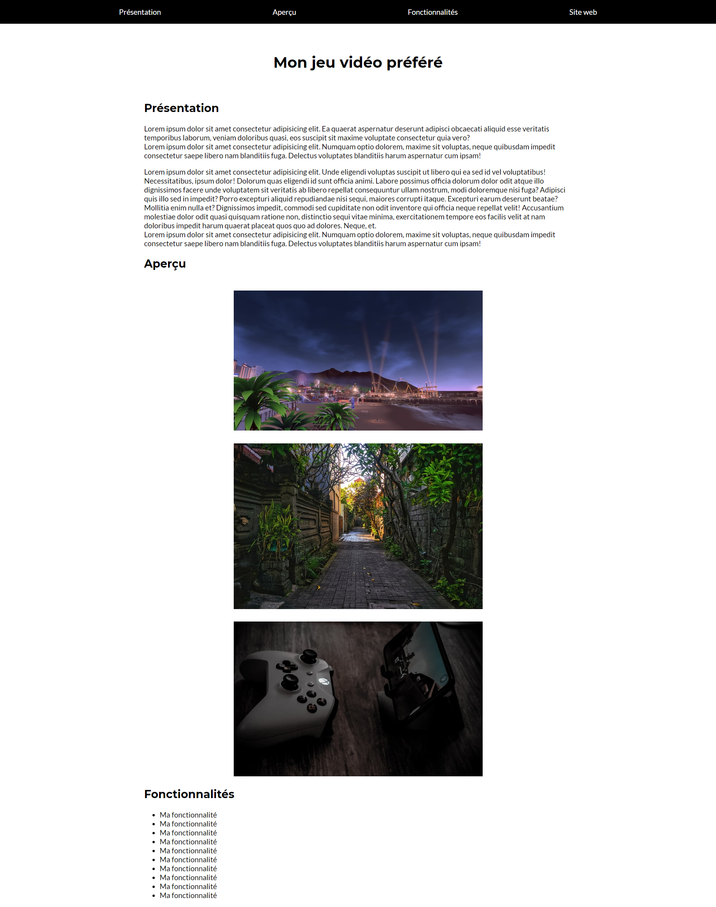

# B1 - DS n°1

Vous allez réaliser une page HTML sur votre jeu vidéo préféré.

## Spécifications

Vous aurez probablement remarqué plusieurs choses dans cette page :

- Le menu a un fond noir
- Les liens du menu sont de couleur blanche, non soulignés
- Les éléments du menu sont bien dans une liste `ul`, mais n'ont pas de pastille associée
- Les éléments du menu sont espacés horizontalement
- Le titre principal est centré
- La zone de contenu (qui contient Présentation, Aperçu, Fonctionnalités), est centrée également
- Les images se trouvant dans la section "Aperçu" ont un léger espace entre elles

### Enlever la pastille des éléments d'une liste

Cherchez sur Google : "CSS remove list item bullet".

### Espacement horizontal des liens du menu

Indice : reprenez le modèle **flex** que l'on a vu en cours et explorez les autres possibilités d'espacement horizontal.

### Zone de contenu

Vous devrez englober les 3 sections de votre page dans un **conteneur**, auquel vous pourrez donner l'identifiant `content` ou `contenu` par exemple.

Ceci vous permettra de **réduire la largeur** de l'élément `content` à, mettons 1000 ou 1100px.

Votre contenu sera ainsi plus lisible, car moins "étiré" sur l'ensemble de la page.

Mais vous constaterez que vos contenus sont collés à gauche.

Pour centrer votre conteneur `content`, appliquez-lui simplement la règle CSS `margin: auto`, nous en reparlerons en cours.

>Note : si vous n'y arrivez pas, ne perdez pas de temps là-dessus, et laissez votre contenu collé à gauche. Ce n'est pas pénalisant pour la note finale.

### Images dans la zone "Aperçu"

Téléchargez des images sur Unsplash par exemple, en basse résolution (largeur 640px ça fera parfaitement l'affaire, c'est le cas dans l'aperçu donné comme exercice).
